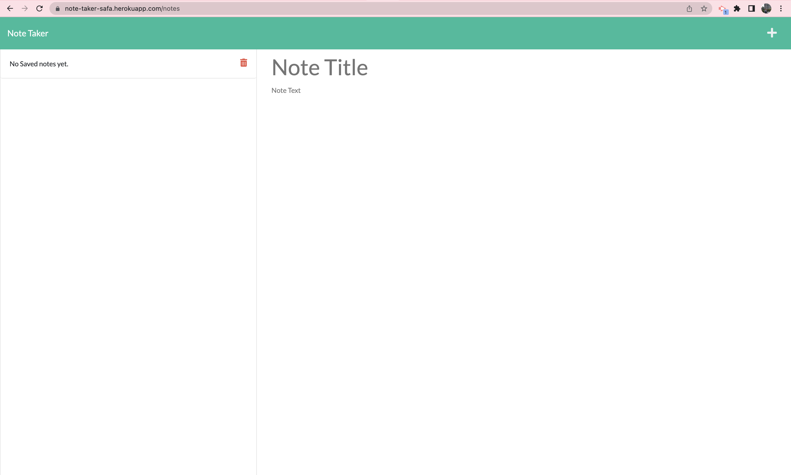
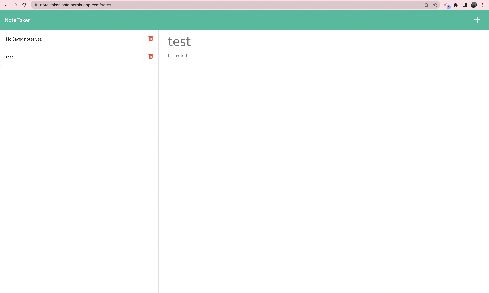

# Note-Taker

 ## Description:

AS A small business owner I WANT to be able to write and save notes
SO THAT I can organize my thoughts and keep track of tasks I need to complete.

GIVEN a note-taking application
If I open the Note Taker, I am presented with a landing page with a link to a notes page.
If I click on the link to the notes page, I am presented with a page with existing notes listed in the left-hand column, plus empty fields to enter a new note title and the note’s text in the right-hand column.
If I enter a new note title and the note’s text, a Save icon appears in the navigation at the top of the page.
If I click on the Save icon, the new note I have entered is saved and appears in the left-hand column with the other existing notes.
If I click on an existing note in the list in the left-hand column, that note appears in the right-hand column.
If I click on the Write icon in the navigation at the top of the page, I am presented with empty fields to enter a new note title and the note’s text in the right-hand column.

## Images:

The following images show the web application's appearance and functionality:

 * The URL of the functional, deployed application:

    https://note-taker-safa.herokuapp.com/